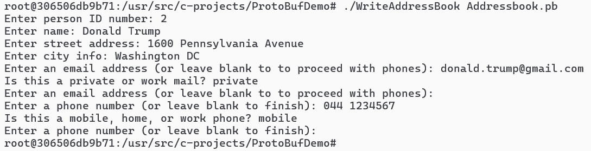
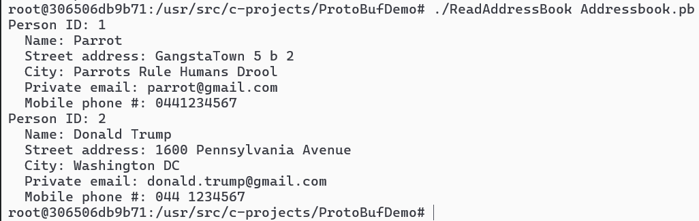

# About the course

Distributed software course tries to teach how udp and tcp sockets and mqtt protocol work. Idea is to stay slightly on the realm of embedded programming, so more like process communicating to another process on linux etc, rather than something done purely between web servers. The language will be C or C++.

The tasks during the course split to next topics:

1. Makefile assignment, to get basic understanding about compiling larger C++ project is done professionally.
2. UDP Echo assignment, to teach how udp socket works. UDP sockets are not stream but packet based. So udp socket simply sends a packet and hopes it finds its destination.
3. TCP Echo assignment, to teach how tcp socket works. TCP sockets are stream based, so there is a separate thread handling incoming connection requests, and it creates a new thread, that serves a single client. The connection will be kept up until client is satisfied and shuts it down.
4. TODO: add when know. Possibly gRPC assignemnt.

## Task 1: Makefile assignment

### Basic idea

The code is very simple itself. The main point of assignment is the makefile, that shows example how to professionally (in linux environment) compile C++ code from multiple files.

### Docker containers

Create one docker container from dockerfiles / docker-compose.yaml, with profile "makefile". It is based on "server" dockerfile, though in reality it does not need all the packets server container has, server file installs for example the make software to compile C++.

## Task 2: UDP Echo Socket

### Basic idea and architecture

Udp server will store data received from client.

Files will be stored into "data" folder with same name as client sent. Large files will be accumulated from multiple data packets.

Messages will be stored into "messages.txt" file with a timestamp.

Data will be sent in JSON form, because that allows knowing type of data, possible filename and also content. The json will have next fields:

-   type: "file" || "message"
-   filename: "example.txt"
-   content: "Hello world!"
-   append: 1 || 0

With these informations we will know, if we are going to replace old obsolete file totally, or if we are just going to append to existing file.

### Docker containers

Both are supposed to run inside their own docker containers. U can turn on them both at once by making sure compose.yaml has the codes uncommented, and then by writing next commands:

-   docker compose down
-   docker compose up --build -d

The environmental variables make sure they have the correct mount bind folders. So inside both containers, there is a "c-projects" folder, that has straight access to windows folder with the names "udp-echo-server" and "udp-echo-client", to access the source code of host pc.

### Compiling udp server and udp client

The code is made to run on Linux. It means that it has some errors on Windows. That's why you compile it inside the container. So, go inside dockers with (one for server, one for client):

-   'docker exec -it <container_name> /bin/bash'

And run next commands (notice we link cjson library):

-   Server: gcc -g udp-echo-server.c -o server -lcjson
-   Client: gcc -g udp-echo-client.c -o client -lcjson

### Starting the udp server

The server is a code with endless while loop. so when it is started, it will stay on until stopped with CTRL+C. The client will meanwhile send a single message and turn off.

To turn on the server, it allows parameters:

-   -p = 'port to listen'
-   -d = 'delay before responding'.

Idea is that, we can artificially induce some delay, so we can try out delay-situations that could happen in a real distributed system. Perhaps client has a timeout after a few seconds or something.

The parameters are not mandatory for the server, so it can just be turned on, and it will then use default values (port 8080 and delay 0 seconds). Example use:

-   ./server -p 12700 -d 5

### Using the udp client

To use the client, it can simply be turned on inside the command prompt (docker exec) view. So, it will deliver one message and receive the outcome, and after that, turn itself off. It is not a loop. Client can be given parameters:

-   -h = '(host's/server's) ip address to send messages'
-   -p = '(host's/server's) port to send messages'
-   -d = 'Data of the message, max 1000 bytes. If put @ at the beginning, it is a link to text file.
-   -t = 'Timeout and after time has passed assume udp packet is lost.
-   -a = 'Append mode. "append" means yes append and "new" means replace file content.

Example use (remember, you can use docker inspect <container_name> to find out an ip address of server)

-   ./client -h 172.20.0.2 -p 12700 -d "Halloween is the greatest celebration of year!" -t 5
-   ./client -h 172.20.0.3 -p 12700 -d "@./data/lotr-story.txt" -t 5 -a "new"

## Task 3: TCP Echo Socket

The basic idea is to create a tcp client in C++ language, that sends 10000 messages at once, 3x tcp servers in C++ language that receive the messages, and a nginx load balancer container, that delivers the messages to these 3 tcp servers. Tcp servers print how many messages received per connection thread, to allow seeing that load balancing works as supposed.

### Basic usage

#### Create every containers needed for project:

First go into folder _'01_dockerfiles/'_, and in there run:

-   docker compose --profile tcp up --force-recreate --build -d --scale tcp_server=3

#### Build server source code:

Every server has same mount bind folder at _'04_tcp-echo/tcp-echo-server'_, so build source code only once.

-   docker exec -it <container_name> /bin/bash
-   cd c-projects/
-   g++ -std=c++14 -pthread -g tcp-echo-server.cpp -o server

#### Tcp server run:

This time docker exec -it into all 3 containers, and inside there run:

-   ./server -p 8082

#### Tcp client build:

We have just one client. It has mount bind into folder _'04_tcp-echo/tcp-echo-client'_. So docker exec into the client container, and run next build command:

-   docker exec -it ds-2025-student-tcp_client-1 /bin/bash
-   cd c-projects/
-   g++ -std=c++14 -pthread -g tcp-echo-client.cpp -o client

#### Nginx loadbalancer

Nginx container should start automatically, if u created all containers. But make sure it is running with docker ps, and then also check that nginx conf file is mount binded correctly (its content should be same as _'04_tcp-echo/nginx-loadbalancer/nginx.conf'_)

-   _docker ps_.
-   docker exec -it <container_name> /bin/sh
-   cat etc/nginx/nginx.conf

#### Debugging tips

If there is problems with delivering messages to all servers, the first thing to suspect is that docker created servers with different ip address than given in nginx.conf file.

You may check the ip addressed with command:

-   docker network list
-   docker inspect <network_name>

To recreate a container, here is example (have a look at docker-compose.yaml for more info):

-   docker compose --profile tcp up --force-recreate --build -d nginx-loadbalancer

#### Send 10000 messages with tcp client

Without nginx and with only 1 running tcp server send messages via:

-   ./client -h ds-2025-student-tcp_server-1 -p 8082 -m "Hello TCP Server" -c 10000

With nginx as loadbalancer and 3 running tcp servers send messages via:

-   ./client -h ds-2025-student-nginx-loadbalancer-1 -p 8084 -m "Hello TCP Server" -c 10000

## GRPC

#### ProtoBuf Demo (Persons)

install needed libraries:

-   apt-get update
-   apt-get install -y \
    build-essential \
    cmake \
    pkg-config \
    protobuf-compiler \
    libprotobuf-dev \
    libprotoc-dev \
    protobuf-compiler-grpc \
    libgrpc-dev \
    libgrpc++-dev

check that protoc surely is installed

-   protoc --version

next go to the ProtoBufDemo folder, and compile pb.h pb.cc files with the protobuf compiler:

-   protoc --cpp_out=. addressbook.proto

and then compile both reader and writer:

-   g++ -std=c++14 -I/usr/local/include -L/usr/local/lib ReadAddressBook.cpp addressbook.pb.cc -lprotobuf -pthread -o ReadAddressBook
-   g++ -std=c++14 -I/usr/local/include -L/usr/local/lib WriteAddressBook.cpp addressbook.pb.cc -lprotobuf -pthread -o WriteAddressBook

Finally create an empty database for the protobuf to store data (without db file, it wont work, it wont be able to write data anywhere or read it from anywhere):

-   touch Addressbook.db

Start running the program with:

-   ./WriteAddressBook Addressbook.pb

After storing enough persons into the file, use Read program:

-   ./ReadAddressBook Addressbook.pb

#### gRPCMathService

install needed libraries

-   apt-get update
-   apt-get install -y \
    build-essential \
    cmake \
    pkg-config \
    protobuf-compiler \
    libprotobuf-dev \
    libprotoc-dev \
    protobuf-compiler-grpc \
    libgrpc-dev \
    libgrpc++-dev

check grpc is sure installed

next go to the gRPCMathService folder, and compile pb.h pb.cc files with the protobuf compiler:

-   cd c-projects/gRPCMathService/

Compile all files with the makefile:

-   make
