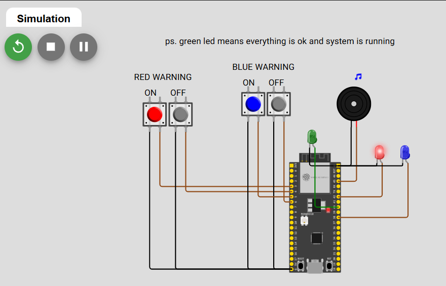
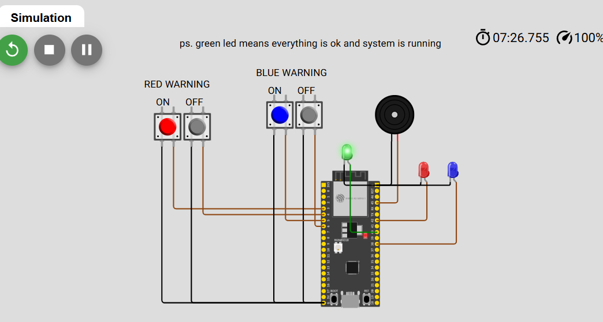

## Alarm System

last updated: 25.11.2025

The idea of this project is to make an alarm system, that utilizes FreeRTOS 'real time OS' to prioritize red alarm over others.

I selected board ESP32-S2-DevKitM-1 for the project. It is a relatively robust board, but slightly cheaper and easier to use than the industry standard v4.

-   https://docs.espressif.com/projects/esp-idf/en/v5.2/esp32s2/hw-reference/esp32s2/user-guide-devkitm-1-v1.html

Basic functionality of the app:

-   1. Green led blinking means the system is running and everything is OK.
-   2. Red blink and alarm sound mean, there is a severe alarm going. It can be turned off from the grey button next to red button, that starts the alarm. (Ideally in real life it would be some kind of automatized process that starts the alarm, but this is a bit demo still...)
-   Blue blink means, there is a moderate alarm going. There can be going severe and moderate alarm simultaneously. Blue blinking is a bit more calm.

So, the basic architecture of my project is next:

-   1. Global variables for severe_warning and moderate_warning, which allow to access via functions these status of warnings rather than just directly control leds
-   2. Severe Warning, Moderate Warning and System is OK are separate actions and separate functions
-   3. Button_Task is a single function, that receives parameters via xCreateTask() function, and after casting and saving them into variables can individualize action. E.g same function turns on severe warning and turns off moderate warning.
-   4. button_task_parameters_t struct allows this parametirized approach to button_task function.
-   5. Main function initiates every pin gpio, e.g is it input our output pin, etc. Much more effective and secure to run in real life.
-   6. I was first thinking to use notes.h headerfile to make a bit more sophisticated sound, but these esp-idf boards don't seem to support sound very well, and do not own a real board to actually test it...
