# Basic idea of entire project

The project is a data pipeline, where NodeRED simulates to be iot dht22 chip data. NodeRED sends the data as MQTT message to Mosquitto server, which is a MQTT broker. Telegraf server, that is used a lot by industry to transfer data from monitoring systems, is the subscriber for mosquitto. Everytime there is a "+/+/+" topic in mosquitto, it will deliver it to Telegraf. Telegraf conf meanwhile has determined the output to be the influxdb time series database, and writes the data in there. After that Grafana receives data from influxdb, and draws dashboard of it.

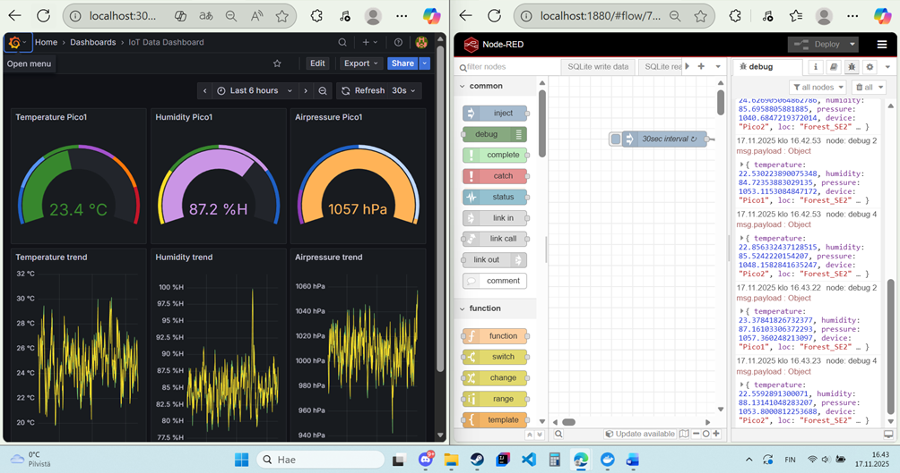

## structure of folders

"Defs" contains all needed dockerfiles. While other folders, such as "grafana" or "mosquitto" or "telegraf", are mount binded into these containers. Therefore for example our telegraf container has access to the telegraf.conf file, that locates in telegraf/telegraf.conf. The codes themself are not stored here, but for example NodeRED functions are stored within the system that we cannot directly modify them here via the vs code IDE.

## NodeRED

NodeRED is a low-code platform, used a lot by automation engineers and similars. The basic structure to send MQTT data with NodeRED is next:
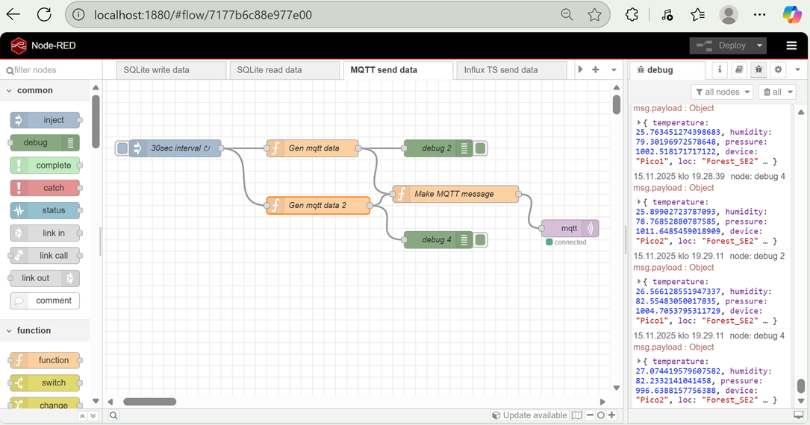

So, there are functions that generate the DHT22 (temperature, humidity, air pressure) data. And then they send them as MQTT message with the mqtt "block". The code are somewhat simple. Important things to mention are flows, that allow globally accessing variable. For example, Pico2 device can use Pico1 device variable's data with the flow.set and flow.get commands. In NodeRED otherwise important concept is the msg.payload. We deliver things forward from step to step with these payloads. Here is an example code:

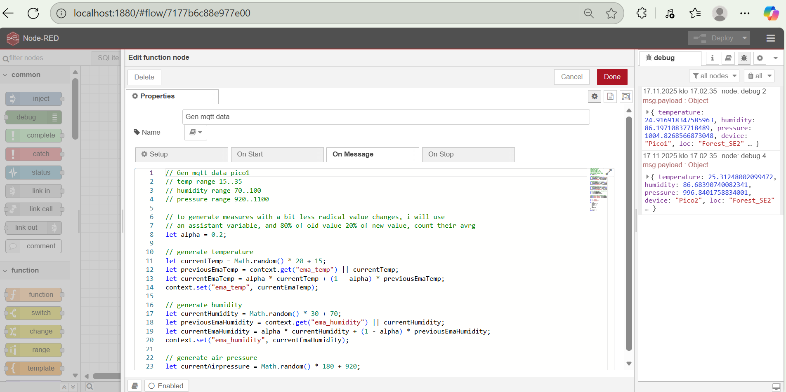
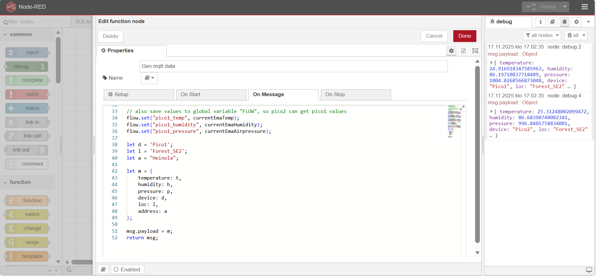

And then just make sure the mqtt-out node has correct url to the mosquitto server, so data can be sent to the broker:
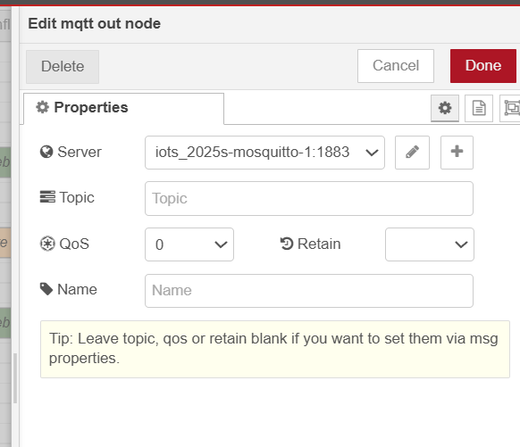

## Mosquitto broker

If you want to test manually, whether MQTT messages work, you may turn on the telegraf container into 2 windows, and run in other command to publish, others to subscribe:

-   mosquitto_sub -h iots_2025s-mosquitto-1 -t "iots_2025/TT10/kitchen"
    to publish aka send mqtt message:
-   mosquitto_pub -h mosquitto -t "iots_2025/TT10/kitchen" -m '{"address": "TT10", "loc":"kitchen",

Now that basic functionality is verified, we can move on to receive data from NodeRED to telegraf. NodeRED has next contents for data:

-   const org = 'iots_2025';
-   const addr = 'Heinola';
-   const loc = 'Forest_SE2';
-   let device = 'Pico1';

Remember that we do not want to subscribe every different devices separately. Therefore, when we subscribe, we will just wait for accurasy of location, so use next command so subscribe and receive data from NodeRED:

-   mosquitto_sub -h localhost -t "iots_2025/Heinola/Forest_SE2"

## INFLUXDB

Credentials are next:

-   Username: lohikrme
-   Salasana: Koodaus1
-   Organisaatio: Lab University
-   Bucket name: iots_2025s_test_data
-   Token:
    
vS0HVFGmuus2bTK1HwvYBwBiBzTyCvCaSsmzJbBTk2IZJsRiacPEScUFfUxttU1UP0jPMIV3l7jOdyGjOkggUg==

Influxdb is a time series database. What this means is that it is specialized to store data that is generated within time - ideal for iot projects. Inside InfluxDB u may define a "bucket" to store data. Bucket is important, both Telegraf and Grafana will use this bucket to write or read the data.

Tässä esimerkki InfluxDB tuottamasta dashboardista. InfluxDB:llä on sisäänrakennettu hienot ominaisuudet visualisoida dataa, joten grafanan käyttö ei olisi tässä projektissa edes ollut välttämätöntä.
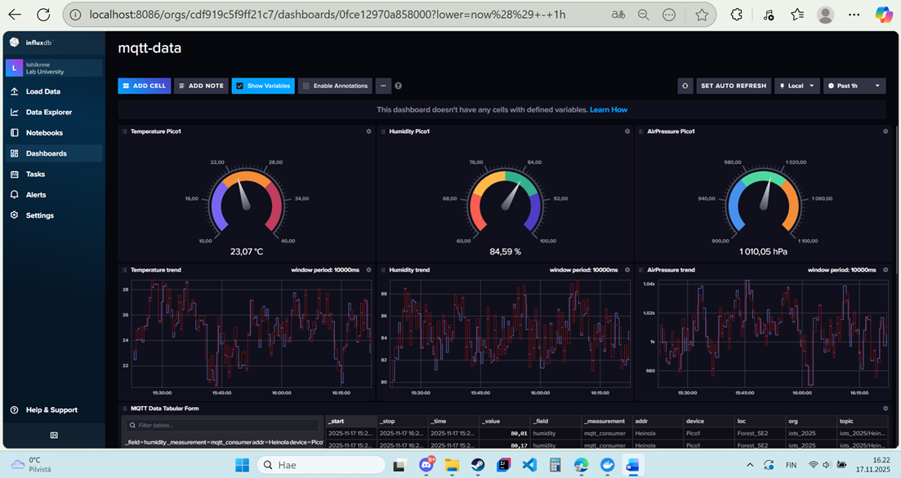

Tässä näkyy miten dataa valitaan filteröimällä esim Pico1 laite eikä Pico2 laite, jne. Huomioi myös "script editor" on todella tärkeä, sieltä näkee tarkkaan mitä se tekee. Riippuu InfluxDB versiosta mitä kieltä script editor käyttää. Täältä editorista voi myös hakea grafanaa varten koodit.
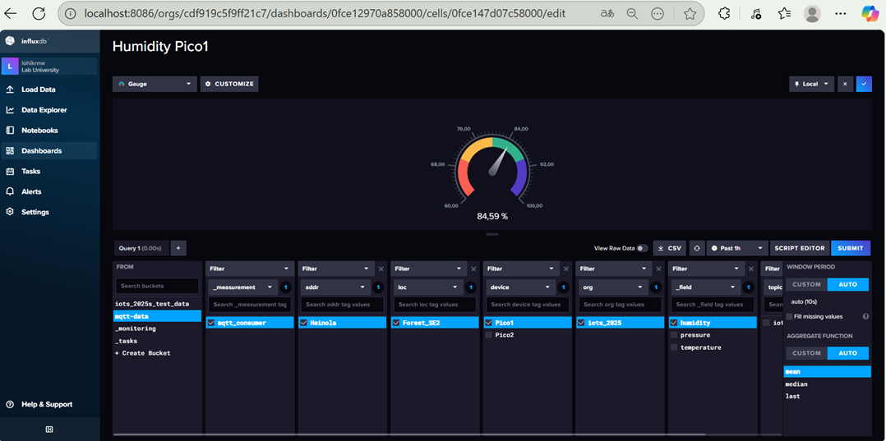

## Grafana

Grafana on ohjelma, jolla voi visualisoida ja hakea dataa monista industryn käyttämistä ohjelmista. Toimii aika samalla tavalla kuin InfluxDB, joten sen kummempaa esittelyä tässä ei tehdä. Paitsi että muista käyttää InfluxDB:n script editoria siihen, että copy pasteet sopivan koodin, jolla sitten saat sen datan haettua sieltä bucketista. Ja ennen tätä, mene Connections välilehdelle ja luo siellä uusi data source, joka yhdistää esim tässä projektissa sinne InfluxDB konttiin:
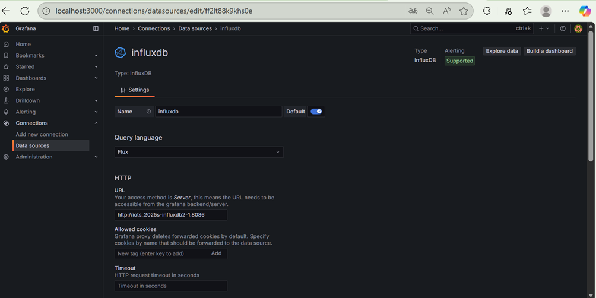
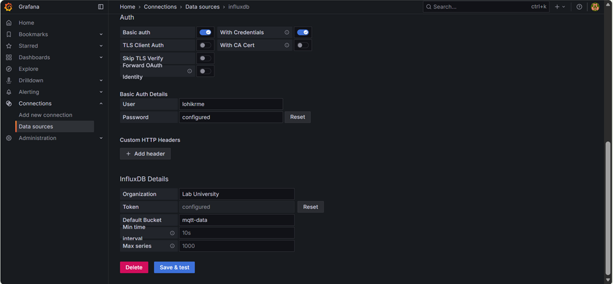
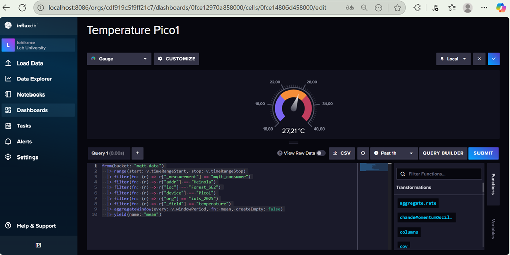

Grafana credentials are next:

-   Username: admin
-   Password: Koodaus1

First time enter with username: admin password: admin
Set new password: Koodaus1

Then go to connections - select influxdb - select Query language flux because influxdb 2.0.

Set url: http://iots_2025s-influxdb2-1:8086

Security settings: Basic auth and With Credentials

Basic Auth details:Username and password from Influxdb

Influx credentials: Other influx stuff from this readme above.

## Paho-MQTT

Paho MQTT is a library, that allows developers to write a code that sends MQTT messages to e.g Mosquitto broker server. In our course we will use it with C++ 17 version programs.

The container for Paho-MQTT has most dependencies pre-installed, but the cloning must be done manually (due to technical problems i faced).

Please have a look at the newest official documentation:

-   https://github.com/eclipse-paho/paho.mqtt.cpp

Mutta lyhyet ohjeet, miten asensin kirjaston kontin sisälle, eli ensin menin /usr/src kansioon, ja sitten ajoin seuraavat komennot:

-   git clone https://github.com/eclipse/paho.mqtt.cpp
-   cd paho.mqtt.cpp/
-   git checkout v1.5.3
-   git submodule init
-   git submodule update
-   cmake -Bbuild -H. -DPAHO_WITH_MQTT_C=ON -DPAHO_BUILD_EXAMPLES=ON
-   cmake --build build/ --target install

Ja sitten testasin, että asennus meni oikein ajamalla _'ls /usr/local/include/mqtt'_. Jos se listaa paljon headereita, mm. client.h, todennäköisesti asennus meni oikein. Mutta sitten pitää vielä ajaa:

-   ldconfig
-   ldconfig -p | grep paho

LDconfig tarvitaan siis siihen, että linkitetään kirjastot linkerille. Linuxissa on dynaaminen linkkeri, joka etsii ne kirjastot, joita ohjelmat tarvitsevat. Idea on se, että ei tarvitse ladata kaikkia tiedostoja kerralla projektiin vaan vain tarvittavat pari funktiota. Liittyy shared library asioihin '.so' tiedostot.

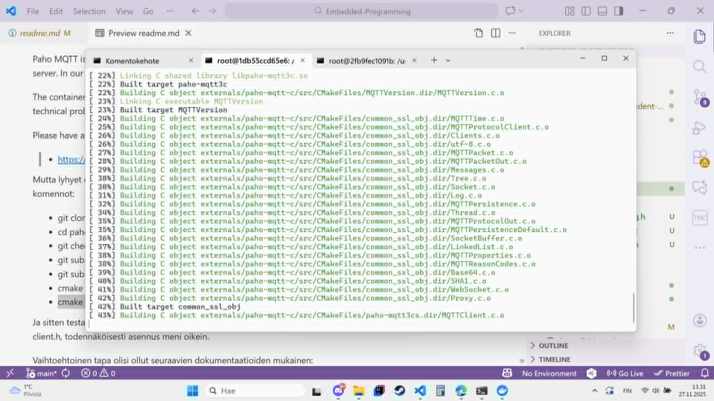
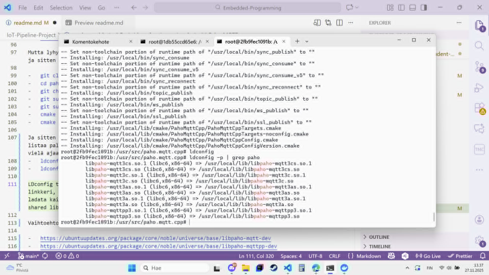

Vaihtoehtoinen tapa olisi ollut seuraavien dokumentaatioiden mukainen:

-   https://ubuntuupdates.org/package/core/noble/universe/base/libpaho-mqtt-dev
-   https://ubuntuupdates.org/package/core/noble/universe/base/libpaho-mqttpp-dev
-   https://askubuntu.com/questions/148638/how-do-i-enable-the-universe-repository

Todettakoon, että en saanut vaihtoehtoista tapaa toimimaan. Siinä olisi siis vain lisätty pari pakettia dockerfilen apt-install listalle, esim libpaho-mqtt3c-dev.

## PAHO MQTT Publisher (written with C-code)

compile with next parameters:

-   (gcc.....................compile pure c)
-   (-o......................output name of software u want to run)
-   (.c file names:..........list of files to compile)
-   (-I/usr/local/include....add a path for headers (.h files))
-   (-L/usr/local/lib........add a path for libraries (.so or .a files))
-   (-lpaho-mqtt3as..........link asynchronous paho mqtt library as dynamic library)
-   (lpthread................link posix thread library to software, paho mqtt needs multithread support)

So, the overall command to compile is:

-   gcc -o mqtt-ambient-publisher mqtt-ambient-publisher.c mqtt-ambient-data.c -I/usr/local/include -L/usr/local/lib -lpaho-mqtt3as -lpthread

test run with default values (default is topic 'LAB/DS2025s/Ambient' oneshot so 1 mqtt message):

-   ./mqtt-ambient-publisher -h tcp://iots_2025s-mosquitto-1:1883 -c MQTTAmbientPub

if paho-mqtt is not found during run, use next command:

-   export LD_LIBRARY_PATH=/usr/local/lib:$LD_LIBRARY_PATH

test functionality by going inside mosquitto container and run:

-   mosquitto_sub -h localhost -t "LAB/DS2025s/Ambient"

Now that we have verified functionality (mosquitto was able to receive and ack), next we will publish in FOREVER mode messages every 60 second with topic we define manually:

-   ./mqtt-ambient-publisher -h tcp://iots_2025s-mosquitto-1:1883 -c MQTTAmbientPub -t iots_2025/Lahti/Forest2 -F -d 60

debugging: do not use qos 1 or qos2, they do not work. OnDeliveryComplete never happens, so it will get stuck to waiting for publish.

Because we use iots_2025/+/+ in "topics" of telegraf, we will automatically receive these mqtt messages as long as the organization aka first param is match.

In Grafana to swap between Heinola and Lahti data, we need to create separate dashboard for Lahti and separate for Heinola, and after that, create a Playlist under Dashboards Menu. Then start the playlist in "Kiosk" mode.

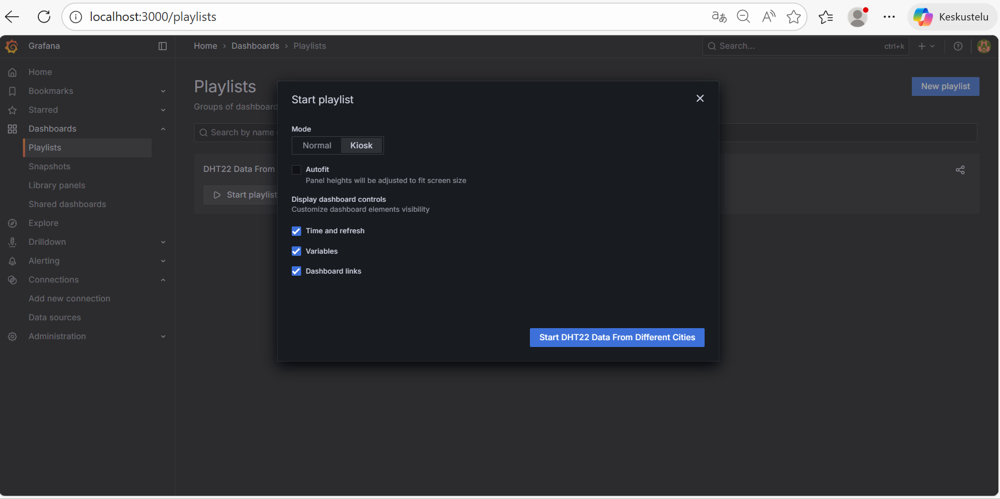
